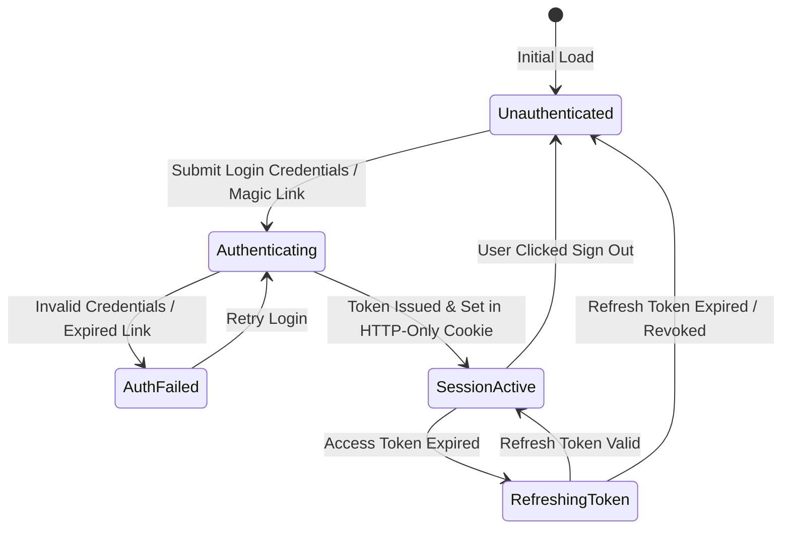
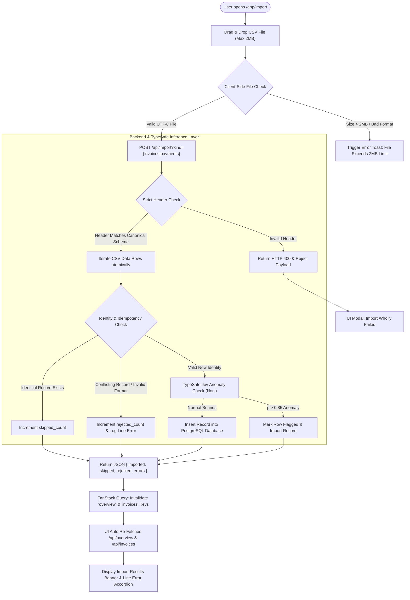
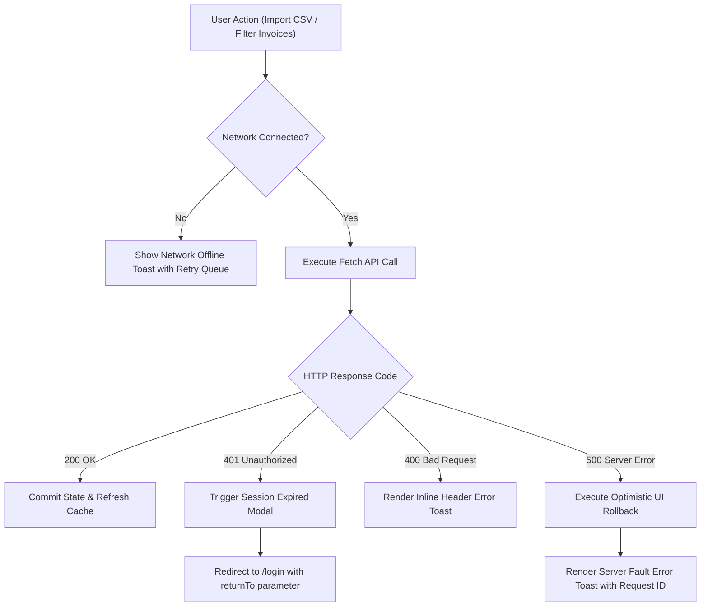

# App Flow, Navigation Matrix & State Machine Specification

**System Name:** ClearLedger — Financial Invoice & Payment Reconciliation Register  
**Author:** Principal UX Systems Architect & State Machine Engineer  
**Version:** 1.0.0-FLOW  
**Status:** Approved for Engineering Implementation  

---

## 1. SITEMAP & ROUTE TOPOLOGY

| Route Path | Auth Level | Layout Shell | Rendering Mode | Purpose & Data Scope |
| --- | --- | --- | --- | --- |
| `/` | Public | Landing Layout | SSG | Product overview, value proposition, documentation link |
| `/login` | Public (Unauth) | Auth Card Layout | Client Island | Supabase Magic Link / Password authentication form |
| `/app/overview` | Authenticated | App Shell + Sidebar | RSC + Client Island | Main financial dashboard (`summary`, open count, `outstanding`, unmatched payments) |
| `/app/invoices` | Authenticated | App Shell + Sidebar | RSC + Client Island | Primary invoice table with status tabs (`all`, `open`, `paid`) and customer filter |
| `/app/import` | Authenticated | App Shell + Sidebar | Client Island | Drag-and-drop CSV uploader for invoices and payments with error table |
| `/app/reports` | Authenticated | App Shell + Sidebar | RSC | Export center & CSV report generator (`GET /api/export`) |
| `/app/settings` | Authenticated | App Shell + Sidebar | RSC | Workspace settings, customer identity registry (`HARBOR`, `MAPLE`, `NORTH`) |

---

## 2. MERMAID.JS STATE MACHINES & FLOWCHARTS

### 1. Authentication & Session State Machine

### 2. Core Feature User Loop: CSV Import & Idempotent Ledger Mutation

### 3. Exception, Network Failure & Re-Authentication Workflow

---

## 3. SCREEN-BY-SCREEN INTERACTION MATRIX

| Source Screen | Trigger Element | Event Action | Target State / Destination | Loading / Pending State | Error Handling / Rollback |
| --- | --- | --- | --- | --- | --- |
| `/app/overview` | `Import Invoices` Button | Click | Navigate to `/app/import?kind=invoices` | Instant page transition | N/A |
| `/app/overview` | `Export Report` Button | Click | Trigger file download `GET /api/export` | Spinner icon on button (`isExporting=true`) | Toast error if server returns 500 |
| `/app/invoices` | Status Tab (`open`) | Click | Filter invoice table state (`status=open`) | Skeleton rows in table body | Retain previous active tab state on network error |
| `/app/invoices` | Customer Filter Select | Select Option | Update query params & re-fetch `/api/invoices` | Inline table spinner | Revert filter dropdown to prior selection on error |
| `/app/import` | Dropzone Area | File Drop | Stream POST raw CSV to `/api/import` | Progress bar overlay + disable dropzone | Render inline error summary table with line numbers |
| `/app/import` | `Clear Results` Button | Click | Reset local error state & dropzone | Instant reset | N/A |
| `/app/settings` | `Reset Demo Data` | Click | Open Confirm Reset Modal | Modal transition | N/A |
| Modal Dialog | `Confirm Reset` Button | Click | Execute `POST /api/reset-demo` | Button spinner (`isResetting=true`) | Toast error: "Failed to reset register data" |

---

## 4. MODAL, DRAWER & TOAST REGISTRY

### 1. Overlay Dialog Catalog

| Overlay ID | Type | Trigger Source | Dismiss Rules | Content & Functionality |
| --- | --- | --- | --- | --- |
| `MODAL_CONFIRM_RESET` | Modal | Settings page `Reset Demo Data` | Backdrop click, `Esc` key, or Cancel button | Warns user that database will revert to synthetic 6-invoice demo; requires explicit confirmation. |
| `DRAWER_INVOICE_DETAIL` | Drawer | Table row click in `/app/invoices` | Close button `X`, Backdrop click, `Esc` key | Displays full payment audit history attached to selected invoice `(customer_id, invoice_number)`. |
| `MODAL_IMPORT_SUMMARY` | Modal | Post-import when `rejected > 0` | Close button, `Esc` key | Displays line-item diagnostic table showing exact CSV line number and failure reason. |
| `MODAL_SESSION_EXPIRED` | Modal | API 401 HTTP response | Non-dismissable (Requires re-login button click) | Informs user their session timed out; preserves pending input state in `localStorage` prior to redirect. |

### 2. Toast Notification Rules
* **Success Toast (Emerald):** Triggered on clean import (`rejected = 0`). Auto-dismiss after 4,000ms. Message: *"Import complete: X imported, Y skipped."*
* **Partial Error Toast (Amber):** Triggered on import with rejections (`rejected > 0`). Auto-dismiss after 8,000ms. Contains link to view error detail modal.
* **Network Error Toast (Rose):** Triggered on network disconnection or 500 API responses. Persistent until manually dismissed or connection restored.

---

## 5. OPTIMISTIC UI PROTOCOLS

### Protocol 1: Invoice Status Tab Switching
* **User Trigger:** Operator clicks the `open` status tab on `/app/invoices`.
* **Optimistic Execution:** 
  1. Immediately highlight the `open` tab indicator and filter existing cached invoices client-side (`balance > 0`).
  2. Background fetch `GET /api/invoices?status=open` via TanStack Query.
* **Rollback Logic:** If background query fails with network error, revert active tab indicator back to previous status (`all`) and display toast alert *"Failed to update invoice view."*

### Protocol 2: Manual Payment Attachment (Future V1.1)
* **User Trigger:** Operator drags an unmatched payment onto an open invoice row.
* **Optimistic Execution:**
  1. Instantly increment invoice `paid` amount, update `balance`, and mark invoice as `paid` if balance $\le 0$.
  2. Remove payment from `unmatched_payments` UI list.
  3. Dispatch `POST /api/reconcile/attach` in background.
* **Rollback Logic:** If backend API rejects attachment (e.g., identity mismatch or database lock), restore payment to `unmatched_payments` list, revert invoice `paid` and `balance` to exact pre-drag values, and display Rose toast *"Attachment failed: Customer identity mismatch."*
