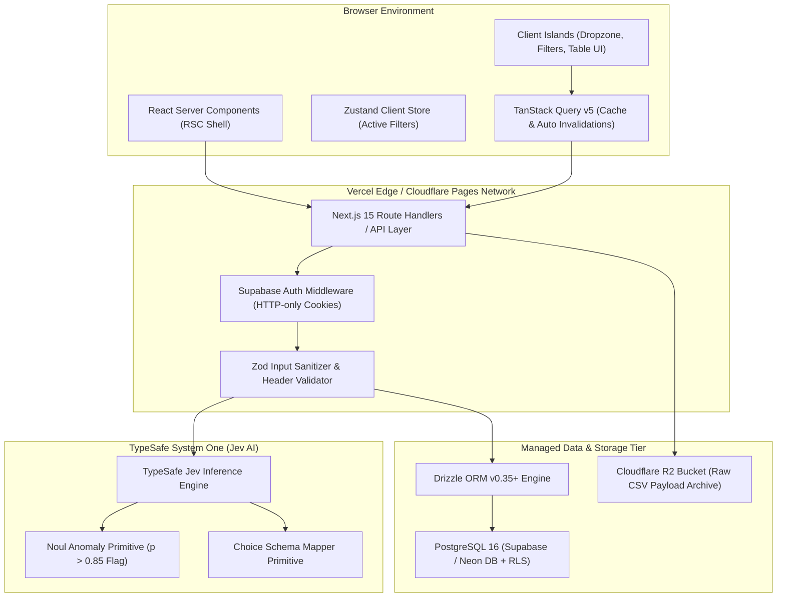

# Technical Requirements Document (TRD)

**System Name:** ClearLedger — Financial Invoice & Payment Reconciliation Register  
**Author:** Staff Infrastructure Architect & Principal Backend Engineer  
**Version:** 1.0.0-PROD  
**Status:** Approved for Engineering Implementation  

---

## 1. SYSTEM ARCHITECTURE & TOPOLOGY

### Rendering & Execution Pattern
ClearLedger implements a **Next.js 15 App Router** architecture utilizing **React Server Components (RSC)** for initial data fetching and static layout rendering, combined with isolated **Client Component Islands (`"use client"`)** for dynamic UI interactions.

* **React Server Components (RSC):** Render main dashboard layouts, initial table state, overview summary cards, and server-driven SEO/metadata shells. RSCs execute direct server-side database queries via Drizzle ORM without client bundle overhead.
* **Client Component Islands (`"use client"`):** Restricted strictly to interactive boundaries:
  * `CSVDropzone Uploader`: Handles file selection, client-side size validation ($< 2\text{ MB}$), and multipart stream posting.
  * `InvoiceTable Controls`: Manages local sorting, status tab toggling (`all` | `open` | `paid`), and customer filtering.
  * `ToastNotification Manager`: Renders real-time import summary alerts and line-item error accordions (`aria-live="polite"`).

### Architecture Topology Diagram



---

## 2. RIGID TECH STACK MATRIX

| Layer | Primary Technology | Version | Enforced Configuration & Standard | Banned Alternatives (Explicitly Forbidden) |
| --- | --- | --- | --- | --- |
| **Language** | TypeScript | `5.6+` | Strict mode enabled (`"strict": true`, `"noImplicitAny": true`, `"strictNullChecks": true`, `"exactOptionalPropertyTypes": true`). | JavaScript (ES6), Any implicit `any` types. |
| **Framework** | Next.js | `15.0+` | App Router (`/app`), React 19 RSC, Server Actions for mutations, Route Handlers for public API. | Pages Router (`/pages`), Express.js, Fastify. |
| **Styling** | Tailwind CSS | `v4.0+` | `@theme` custom properties, native CSS variables (`--color-accent`), Container Queries. | Tailwind CSS v3, Styled Components, Emotion, Plain CSS. |
| **Database** | PostgreSQL | `16.x` | Managed Supabase or Neon DB with connection pooling enabled (`PgBouncer`/Hyperdrive). | SQLite (for production scale), MySQL, MongoDB. |
| **ORM Layer** | Drizzle ORM | `0.35+` | `drizzle-orm/pg-core` with typed SQL schema definitions and automated migrations (`drizzle-kit`). | Prisma (high cold-start overhead), TypeORM, Sequelize. |
| **State Management** | TanStack Query + Zustand | `v5.50+` (Query), `v5.0+` (Zustand) | TanStack Query for server state caching & invalidation; Zustand for client UI drawer & filter state. | Redux, MobX, React Context for heavy global state. |
| **Auth & Security** | Supabase Auth | `@supabase/ssr` | Secure HTTP-only cookies (`sb-access-token`), JWT verification, RLS on PostgreSQL. | Custom JWT rolls, NextAuth (Auth.js v4), Express Session. |
| **Asset Storage** | Cloudflare R2 | S3 API | `@aws-sdk/client-s3` for archiving raw CSV import uploads with signed URLs. | Local disk filesystem storage, AWS S3 direct SDK. |
| **Validation** | Zod | `v3.23+` | Strict runtime schema parsing for API payloads, CSV headers, and environment variables. | Yup, Joi, manual type guards. |

---

## 3. RELATIONAL SCHEMA DDL (Production SQL Script)

```sql
-- Enable required extensions
CREATE EXTENSION IF NOT EXISTS "uuid-ossp";
CREATE EXTENSION IF NOT EXISTS "pgcrypto";

-- Clean drop for idempotent migration testing
DROP TABLE IF EXISTS import_logs CASCADE;
DROP TABLE IF EXISTS unmatched_payments CASCADE;
DROP TABLE IF EXISTS payments CASCADE;
DROP TABLE IF EXISTS invoices CASCADE;
DROP TABLE IF EXISTS customers CASCADE;

-- 1. CUSTOMERS TABLE
CREATE TABLE customers (
    id UUID PRIMARY KEY DEFAULT gen_random_uuid(),
    code VARCHAR(32) UNIQUE NOT NULL CHECK (char_length(trim(code)) > 0),
    name VARCHAR(255) NOT NULL CHECK (char_length(trim(name)) > 0),
    created_at TIMESTAMPTZ NOT NULL DEFAULT NOW(),
    updated_at TIMESTAMPTZ NOT NULL DEFAULT NOW()
);

CREATE INDEX idx_customers_code ON customers(code);

-- 2. INVOICES TABLE
CREATE TABLE invoices (
    id UUID PRIMARY KEY DEFAULT gen_random_uuid(),
    customer_id UUID NOT NULL REFERENCES customers(id) ON DELETE RESTRICT,
    invoice_number VARCHAR(64) NOT NULL CHECK (char_length(trim(invoice_number)) > 0),
    amount NUMERIC(12, 2) NOT NULL CHECK (amount > 0 AND amount <= 10000000.00),
    due_date DATE NOT NULL,
    status VARCHAR(16) NOT NULL DEFAULT 'open' CHECK (status IN ('open', 'paid')),
    created_at TIMESTAMPTZ NOT NULL DEFAULT NOW(),
    updated_at TIMESTAMPTZ NOT NULL DEFAULT NOW(),
    CONSTRAINT uq_customer_invoice_identity UNIQUE (customer_id, invoice_number)
);

CREATE INDEX idx_invoices_customer_id ON invoices(customer_id);
CREATE INDEX idx_invoices_status ON invoices(status);
CREATE INDEX idx_invoices_due_date ON invoices(due_date);

-- 3. PAYMENTS TABLE
CREATE TABLE payments (
    id UUID PRIMARY KEY DEFAULT gen_random_uuid(),
    payment_id VARCHAR(64) UNIQUE NOT NULL CHECK (char_length(trim(payment_id)) > 0),
    customer_id UUID NOT NULL REFERENCES customers(id) ON DELETE RESTRICT,
    invoice_id UUID REFERENCES invoices(id) ON DELETE RESTRICT,
    invoice_number VARCHAR(64) NOT NULL CHECK (char_length(trim(invoice_number)) > 0),
    amount NUMERIC(12, 2) NOT NULL CHECK (amount > 0 AND amount <= 10000000.00),
    created_at TIMESTAMPTZ NOT NULL DEFAULT NOW()
);

CREATE INDEX idx_payments_payment_id ON payments(payment_id);
CREATE INDEX idx_payments_customer_invoice ON payments(customer_id, invoice_number);
CREATE INDEX idx_payments_invoice_id ON payments(invoice_id);

-- 4. UNMATCHED PAYMENTS TABLE
CREATE TABLE unmatched_payments (
    id UUID PRIMARY KEY DEFAULT gen_random_uuid(),
    payment_id VARCHAR(64) UNIQUE NOT NULL CHECK (char_length(trim(payment_id)) > 0),
    customer_id UUID NOT NULL REFERENCES customers(id) ON DELETE RESTRICT,
    invoice_number VARCHAR(64) NOT NULL CHECK (char_length(trim(invoice_number)) > 0),
    amount NUMERIC(12, 2) NOT NULL CHECK (amount > 0 AND amount <= 10000000.00),
    created_at TIMESTAMPTZ NOT NULL DEFAULT NOW()
);

CREATE INDEX idx_unmatched_payments_payment_id ON unmatched_payments(payment_id);

-- 5. IMPORT LOGS TABLE
CREATE TABLE import_logs (
    id UUID PRIMARY KEY DEFAULT gen_random_uuid(),
    kind VARCHAR(16) NOT NULL CHECK (kind IN ('invoices', 'payments')),
    imported_count INT NOT NULL CHECK (imported_count >= 0),
    skipped_count INT NOT NULL CHECK (skipped_count >= 0),
    rejected_count INT NOT NULL CHECK (rejected_count >= 0),
    errors JSONB NOT NULL DEFAULT '[]'::jsonb,
    created_at TIMESTAMPTZ NOT NULL DEFAULT NOW()
);

-- ROW LEVEL SECURITY (RLS) POLICIES

ALTER TABLE customers ENABLE ROW LEVEL SECURITY;
ALTER TABLE invoices ENABLE ROW LEVEL SECURITY;
ALTER TABLE payments ENABLE ROW LEVEL SECURITY;
ALTER TABLE unmatched_payments ENABLE ROW LEVEL SECURITY;
ALTER TABLE import_logs ENABLE ROW LEVEL SECURITY;

-- Read policies for authenticated service users
CREATE POLICY rls_customers_select ON customers FOR SELECT USING (auth.role() = 'authenticated' OR auth.role() = 'service_role');
CREATE POLICY rls_invoices_all ON invoices FOR ALL USING (auth.role() = 'authenticated' OR auth.role() = 'service_role');
CREATE POLICY rls_payments_all ON payments FOR ALL USING (auth.role() = 'authenticated' OR auth.role() = 'service_role');
CREATE POLICY rls_unmatched_payments_all ON unmatched_payments FOR ALL USING (auth.role() = 'authenticated' OR auth.role() = 'service_role');
CREATE POLICY rls_import_logs_all ON import_logs FOR ALL USING (auth.role() = 'authenticated' OR auth.role() = 'service_role');

-- Seed initial static customers required by Business Rules
INSERT INTO customers (code, name) VALUES 
('HARBOR', 'Harbor Services Ltd'),
('MAPLE', 'Maple Enterprises'),
('NORTH', 'North Supply Co')
ON CONFLICT (code) DO NOTHING;
```

---

## 4. API & MUTATION DATA CONTRACTS

| Route / Action | HTTP Method | Zod Request Validator | Typed Return Shape | Auth Guard |
| --- | --- | --- | --- | --- |
| `/api/overview` | `GET` | `z.object({})` | `Promise<OverviewResponseSchema>` | Authenticated / Service Role |
| `/api/invoices` | `GET` | `z.object({ status: z.enum(['all', 'open', 'paid']) })` | `Promise<InvoiceItemSchema[]>` | Authenticated / Service Role |
| `/api/export` | `GET` | `z.object({})` | `Promise<ReadableStream>` (`text/csv`) | Authenticated / Service Role |
| `/api/import?kind=invoices` | `POST` | `z.string().max(2097152)` (Raw CSV Body $\le 2\text{MB}$) | `Promise<ImportResultSchema>` | Authenticated / Service Role |
| `/api/import?kind=payments` | `POST` | `z.string().max(2097152)` (Raw CSV Body $\le 2\text{MB}$) | `Promise<ImportResultSchema>` | Authenticated / Service Role |
| `/api/reconcile/suggest` | `POST` | `z.object({ payment_id: z.string() })` | `Promise<TypeSafeMatchResult>` | Authenticated / Service Role |

### TypeScript Zod Schemas for Contracts

```typescript
import { z } from 'zod';

// Invoice Status Enum
export const InvoiceStatusSchema = z.enum(['all', 'open', 'paid']);
export type InvoiceStatus = z.infer<typeof InvoiceStatusSchema>;

// Invoice Item Schema
export const InvoiceItemSchema = z.object({
  id: z.string().uuid(),
  customer_id: z.string(),
  customer_name: z.string(),
  invoice_number: z.string(),
  amount: z.number().positive(),
  due_date: z.string().regex(/^\d{4}-\d{2}-\d{2}$/),
  paid: z.number(),
  balance: z.number(),
  status: z.enum(['open', 'paid']),
});
export type InvoiceItem = z.infer<typeof InvoiceItemSchema>;

// Summary Schema
export const OverviewSummarySchema = z.object({
  invoice_count: z.number().int().nonnegative(),
  open_count: z.number().int().nonnegative(),
  outstanding: z.number(),
});

// Unmatched Payment Schema
export const UnmatchedPaymentSchema = z.object({
  payment_id: z.string(),
  customer_id: z.string(),
  invoice_number: z.string(),
  amount: z.number().positive(),
});

// GET /api/overview Response
export const OverviewResponseSchema = z.object({
  summary: OverviewSummarySchema,
  invoices: z.array(InvoiceItemSchema),
  unmatched_payments: z.array(UnmatchedPaymentSchema),
});
export type OverviewResponse = z.infer<typeof OverviewResponseSchema>;

// POST /api/import Error Detail
export const ImportErrorDetailSchema = z.object({
  line: z.number().int().positive(),
  reason: z.string(),
});

// POST /api/import Response
export const ImportResultSchema = z.object({
  imported: z.number().int().nonnegative(),
  skipped: z.number().int().nonnegative(),
  rejected: z.number().int().nonnegative(),
  errors: z.array(ImportErrorDetailSchema),
});
export type ImportResult = z.infer<typeof ImportResultSchema>;

// TypeSafe System One Suggestion Schema
export const TypeSafeMatchResultSchema = z.object({
  payment_id: z.string(),
  suggested_invoice_id: z.string().uuid().nullable(),
  confidence_score: z.number().min(0).max(1),
  reasoning_criteria: z.string(),
});
export type TypeSafeMatchResult = z.infer<typeof TypeSafeMatchResultSchema>;
```

---

## 5. ENVIRONMENT VARIABLE INVENTORY

### Server & Client Environment Keys

```typescript
import { z } from 'zod';

export const envSchema = z.object({
  // Node Environment
  NODE_ENV: z.enum(['development', 'test', 'production']).default('development'),
  PORT: z.string().transform(Number).default('8787'),

  // PostgreSQL Database Connection (Supabase / Neon)
  DATABASE_URL: z.string().url({ message: "DATABASE_URL must be a valid PostgreSQL connection string" }),
  DATABASE_DIRECT_URL: z.string().url({ message: "DATABASE_DIRECT_URL required for Drizzle migrations" }),

  // Supabase Auth Credentials
  NEXT_PUBLIC_SUPABASE_URL: z.string().url(),
  NEXT_PUBLIC_SUPABASE_ANON_KEY: z.string().min(1),
  SUPABASE_SERVICE_ROLE_KEY: z.string().min(1),

  // Cloudflare R2 Object Storage
  R2_ACCOUNT_ID: z.string().min(1),
  R2_ACCESS_KEY_ID: z.string().min(1),
  R2_SECRET_ACCESS_KEY: z.string().min(1),
  R2_BUCKET_NAME: z.string().default('clearledger-csv-archives'),

  // TypeSafe System One AI Integration
  TYPESAFE_API_KEY: z.string().min(1).describe('TypeSafe System One API Key for Jev inference model'),
  TYPESAFE_BASE_URL: z.string().url().default('https://api.typesafe.ai/v1'),
});

export const env = envSchema.parse(process.env);
```
